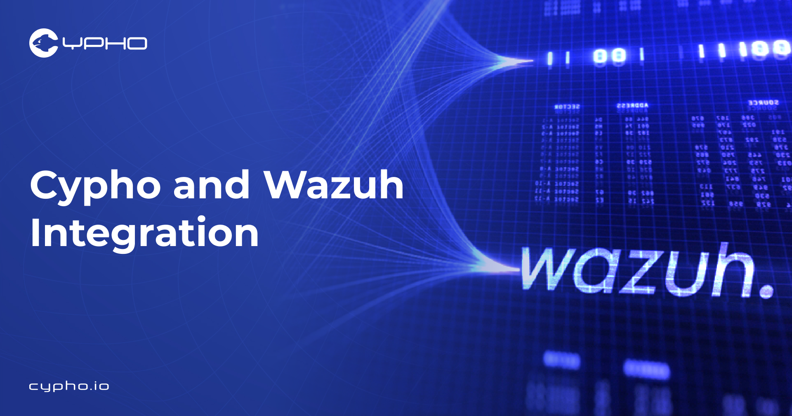

# Cypho Threat Intelligence → Wazuh Integration



Automated ingestion of **Cypho Threat Intelligence** into **Wazuh SIEM**, with normalized JSON events, custom Wazuh rules, and duplicate protection using SQLite.

This connector allows Wazuh users to ingest Cypho TI issues for searching, indexing, alerts, dashboards, and investigations.

---

## 🚀 Features

* Pulls Cypho TI issues via secure API
* Normalizes issues into Wazuh-compatible JSON
* Writes events directly into Wazuh log ingestion
* Uses SQLite to permanently avoid duplicates
* Fully cron-automated

---

## 🔧 Architecture Overview

```text
                   +---------------------------+
                   |       Cypho TI API        |
                   +-------------+-------------+
                                 |
                                 |  HTTPS (JSON)
                                 v
                   +---------------------------+
                   |     Python Connector      |
                   |  /usr/local/bin/cypho_*   |
                   +-------------+-------------+
                                 |
                                 |  Writes JSON events
                                 v
                   /var/ossec/logs/cypho_issues.log
                                 |
                                 v
                   +---------------------------+
                   |    Wazuh Log Collector    |
                   +-------------+-------------+
                                 |
                                 v
                   +---------------------------+
                   |   Wazuh Indexer / SIEM    |
                   +-------------+-------------+
                                 |
                                 v
                   +---------------------------+
                   |     Wazuh Dashboard       |
                   +---------------------------+
```

---

# 🛠️ Requirements

| Component       | Version |
| --------------- | ------- |
| Wazuh Manager   | 4.x     |
| Python          | 3.x     |
| Cypho API Key   | Yes     |
| Root privileges | Yes     |

---

# 📦 Installation (Wazuh Manager)

## 1️⃣ Install the Cypho connector

Create the script:

```bash
sudo nano /usr/local/bin/cypho_to_wazuh.py
```

Paste the script from this repository.

Make it executable:

```bash
sudo chmod +x /usr/local/bin/cypho_to_wazuh.py
```

---

## 2️⃣ Create SQLite storage directory

```bash
sudo mkdir -p /var/lib/cypho
sudo chmod 755 /var/lib/cypho
```

---

## 3️⃣ Create Cypho ingestion log

```bash
sudo touch /var/ossec/logs/cypho_issues.log
sudo chmod 666 /var/ossec/logs/cypho_issues.log
```

---

## 4️⃣ Add Wazuh log ingestion

Edit:

```bash
sudo nano /var/ossec/etc/ossec.conf
```

Add inside `<ossec_config>`:

```xml
<localfile>
  <location>/var/ossec/logs/cypho_issues.log</location>
  <log_format>json</log_format>
</localfile>
```

Restart:

```bash
sudo systemctl restart wazuh-manager
```

---

## 5️⃣ Add Wazuh rule for Cypho TI

Edit:

```bash
sudo nano /var/ossec/etc/rules/local_rules.xml
```

Add:

```xml
<group name="cypho,ti,">
  <rule id="810000" level="7">
    <decoded_as>json</decoded_as>
    <field name="integration">cypho_ti</field>
    <description>Cypho TI Issue: $(title)</description>
    <group>cypho, ti, external</group>
  </rule>
</group>
```

Restart:

```bash
sudo systemctl restart wazuh-manager
```

---

## 6️⃣ Configure Cron (every 1 minute)

Edit:

```bash
sudo nano /etc/cron.d/cypho
```

Add:

```
* * * * * root /usr/bin/python3 /usr/local/bin/cypho_to_wazuh.py >> /var/log/cypho_cron.log 2>&1
```

Save and exit.

---

# 🎯 Verification

### Run manually:

```bash
sudo python3 /usr/local/bin/cypho_to_wazuh.py
```

Expected:

```
[INFO] Wrote X new issues (skipped duplicates)
```

### Check SQLite:

```bash
sudo sqlite3 /var/lib/cypho/cypho_seen.db "SELECT COUNT(*) FROM seen;"
```

### Search in Wazuh:

In **Wazuh Dashboard → Security Events**, search:

```
"data.integration": "cypho_ti"
```

---

# 🧠 Duplicate Protection

The connector stores processed issue IDs in:

```
/var/lib/cypho/cypho_seen.db
```

Meaning:

* No duplicate alerts
* Safe for cron every minute
* No API rate inflation
* Stable for large datasets


---

File paths:

```
/var/lib/cypho/cypho_seen.db
/var/ossec/etc/rules/local_rules.xml
/var/ossec/etc/ossec.conf
/var/ossec/logs/cypho_issues.log
/usr/local/bin/cypho_to_wazuh.py
/etc/cron.d/cypho
```
